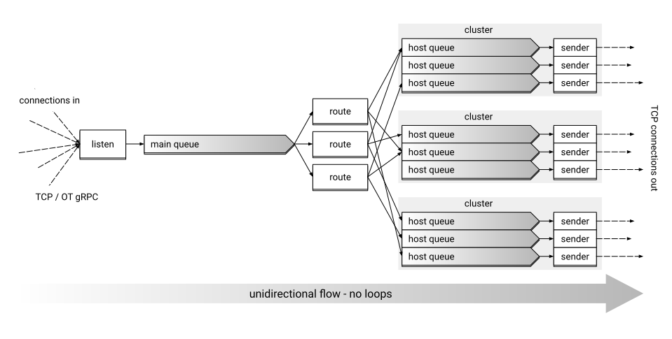

# Nanotube design blueprint

## High-level design

The design overview diagram:

### Record processing order

Records coming in for routing are processed in the following order (as also seen on the diagram):

1. Rec is read from the incoming connection.
2. Rec gets into the main queue.
3. Re-write rules are applied.
4. Routing rules are applied.
5. Rec gets in host queue.
6. Rec is sent out to the target.

## Termination sequence

The steps when the system is shut down:

1. Get interrupt signal.
2. Stop accepting incoming connections.
3. Finish reading from already open connections.
4. Close open connections.
5. Empty *main queue*.
6. Empty *host queues*.
7. Close connections to hosts.
8. Ack termination finish.

## Config

Please see [here](config/README.md) for the config documentation.
